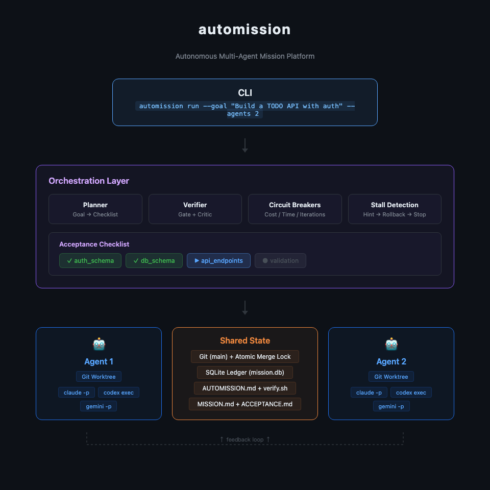

# automission

[](https://pypi.org/project/automission/)
[](https://www.python.org/downloads/)
[](LICENSE)
[](https://github.com/codance-ai/automission/actions/workflows/ci.yml)

Give it a goal. An agent team autonomously collaborates to deliver results.

Decentralized (no orchestrator), no human-in-the-loop.

## Features

- **Goal in, results out** — describe what you want; Planner generates an acceptance checklist with dependencies, agents do the rest
- **Multi-agent collaboration** — agents work in parallel on independent groups, coordinate via shared git + SQLite
- **Multi-backend** — agents, Planner, and Critic all support Claude Code, Codex CLI, and Gemini CLI — mix and match freely
- **Docker-first** — all execution runs inside containers for isolation and reproducibility
- **Daemon mode** — `--detach` to start in background, `attach` to reconnect, `stop`/`resume` to control
- **Safety rails** — circuit breakers on cost, time, and iterations; 3-step stall detection auto-recovers stuck agents

## Quick Start

### 1. Install

```bash
pip install automission
```

Requires [Docker](https://docs.docker.com/get-docker/) at runtime — all agent execution and verification runs inside containers.

### 2. Setup

```bash
automission init
```

Interactive setup walks you through:

1. **Agent backend** — choose `claude`, `codex`, or `gemini`, then pick auth method (API key or OAuth)
2. **Planner backend** — choose independently, then pick auth method
3. **Verifier backend** — defaults to planner settings, or configure separately
4. **Docker image** — checks Docker availability and pulls the agent image

This creates `~/.automission/config.toml`:

```toml
[defaults]
backend = "claude"
model = "claude-sonnet-4-6"

[planner]
backend = "claude"
model = "claude-sonnet-4-6"

[verifier]
backend = "claude"
model = "claude-sonnet-4-6"

[keys]
# Set your API keys here or via environment variables
# anthropic = "sk-ant-..."    # or ANTHROPIC_API_KEY
# codex = "sk-..."            # or CODEX_API_KEY
# gemini = "..."              # or GEMINI_API_KEY
```

<details>
<summary>Manual setup (without init)</summary>

```bash
# Set the API key for your chosen backend
export ANTHROPIC_API_KEY=sk-ant-...   # for Claude (default)
export CODEX_API_KEY=sk-...           # for Codex
export GEMINI_API_KEY=...             # for Gemini
```

</details>

### 3. Run

```bash
automission run --goal "Build a TODO API with auth"
```

Planner auto-generates an acceptance checklist with dependencies. Review it, confirm, and agents start working.

<details>
<summary>More options</summary>

```bash
# Choose model
automission run --goal "..." --model opus

# Multi-agent, choose backend
automission run --goal "..." --agents 3 --backend codex

# Use a different Planner backend
automission run --goal "..." --planner-backend gemini --planner-model gemini-2.5-pro

# Auto-approve Planner output (skip Y/n/edit prompt)
automission run --goal "..." -y

# Skip Planner — provide your own acceptance criteria
automission run --goal "..." --no-planner --acceptance acceptance.md --verify verify.sh

# Goal from file
automission run --goal-file mission-brief.md

# Start in background
automission run --goal "..." --detach
```

**Key flags:**

| Flag | Default | Description |
|------|---------|-------------|
| `--backend` | `claude` | Agent backend: `claude`, `codex`, `gemini` |
| `--model` | `sonnet` | Model for agent execution ([#38](https://github.com/codance-ai/automission/issues/38)) |
| `--planner-backend` | `claude` | Backend for Planner/Critic |
| `--planner-model` | `claude-sonnet-4-6` | Model for Planner |
| `--agents` | `2` | Number of parallel agents |
| `-y` | — | Auto-approve Planner output |
| `--no-planner` | — | Skip Planner (requires `--acceptance`) |
| `--max-cost` | `10.0` | Max total cost in USD |
| `--timeout` | `3600` | Max wall-clock seconds |
| `--api-key` | — | API key override (skips env/config lookup) |
| `--detach` | — | Start mission and return immediately |

</details>

### 4. Monitor & Control

```bash
automission status              # mission overview
automission logs -f             # stream attempt logs
automission attach <mission-id> # reconnect to a running mission
automission stop                # stop most recent running mission
automission stop <mission-id>   # stop a specific mission
automission resume <mission-id> # resume a stopped or crashed mission
automission list                # list all missions
```

## How It Works

1. **You give a goal** — one sentence or a detailed spec
2. **Planner** expands it into an acceptance checklist with dependencies
3. **Agents** work the frontier — groups whose dependencies are satisfied
4. **Each attempt**: agent reads mission context + receives dynamic feedback from last verification
5. **Verifier** checks: `verify.sh` gates pass/fail, LLM critic provides structured feedback
6. **Atomic merge**: verified work lands on main safely (staging ref + regression check)
7. **Loop continues** until all acceptance groups pass or circuit breakers trigger

## Architecture



<details>
<summary>Text version</summary>

```
┌─────────────────────────────────────────────────────────────────┐
│                        automission CLI                          │
│  automission run --goal "Build a TODO API with auth" --agents 2 │
└──────────────────────────────┬──────────────────────────────────┘
                               │
                               ▼
┌─────────────────────────────────────────────────────────────────┐
│                      Orchestration Layer                        │
│                                                                 │
│  ┌──────────┐  ┌──────────┐  ┌──────────┐  ┌───────────────┐  │
│  │ Planner  │  │ Verifier │  │ Circuit  │  │    Stall      │  │
│  │ (CLI)    │  │ Gate +   │  │ Breakers │  │  Detection    │  │
│  │          │  │ Critic   │  │          │  │  (3-step)     │  │
│  └──────────┘  └──────────┘  └──────────┘  └───────────────┘  │
│                                                                 │
│  ┌──────────────────────────────────────────────────────────┐  │
│  │              Acceptance Checklist (Frontier)              │  │
│  │  [✓ auth] [✓ db] [→ api_endpoints] [○ validation]       │  │
│  │                    ↑ current frontier                     │  │
│  └──────────────────────────────────────────────────────────┘  │
│                                                                 │
│  ┌──────────────────────────────────────────────────────────┐  │
│  │        Structured Output Backend (Planner/Critic)        │  │
│  │  claude -p --json-schema │ codex exec │ gemini -p        │  │
│  └──────────────────────────────────────────────────────────┘  │
└──────────────────────────────┬──────────────────────────────────┘
                               │
              ┌────────────────┼────────────────┐
              ▼                                  ▼
┌───────────────────────────┐      ┌───────────────────────────┐
│     Docker: Agent 1       │      │     Docker: Agent 2       │
│                           │      │                           │
│  ┌─────────────────────┐  │      │  ┌─────────────────────┐  │
│  │  claude -p --model   │  │      │  │  claude -p --model   │  │
│  │  codex exec          │  │      │  │  codex exec          │  │
│  │  gemini -p           │  │      │  │  gemini -p           │  │
│  └─────────────────────┘  │      │  └─────────────────────┘  │
│                           │      │                           │
│  Git Worktree:            │      │  Git Worktree:            │
│  branch agent-1-work      │      │  branch agent-2-work      │
└─────────────┬─────────────┘      └─────────────┬─────────────┘
              │                                  │
              └──────────┬───────────────────────┘
                         ▼
┌─────────────────────────────────────────────────────────────────┐
│                       Shared State                              │
│                                                                 │
│  ┌──────────┐  ┌──────────────┐  ┌──────────────────────────┐  │
│  │   Git    │  │   SQLite     │  │     Workspace Files      │  │
│  │  (main)  │  │  (ledger)    │  │  MISSION.md              │  │
│  │          │  │  - attempts  │  │  ACCEPTANCE.md            │  │
│  │  atomic  │  │  - claims    │  │  AUTOMISSION.md           │  │
│  │  merge   │  │  - groups    │  │  verify.sh                │  │
│  │  lock    │  │  - metrics   │  │  skills/                  │  │
│  └──────────┘  └──────────────┘  └──────────────────────────┘  │
└─────────────────────────────────────────────────────────────────┘
```

</details>

## Authentication

API key lookup order (first match wins):

1. `--api-key` flag (per-command override)
2. Environment variable (`ANTHROPIC_API_KEY`, `CODEX_API_KEY`, `GEMINI_API_KEY`)
3. `~/.automission/config.toml` under `[keys]`

| Backend | Env Var | Config Key |
|---------|---------|------------|
| claude | `ANTHROPIC_API_KEY` | `keys.anthropic` |
| codex | `CODEX_API_KEY` | `keys.codex` |
| gemini | `GEMINI_API_KEY` | `keys.gemini` |

**OAuth**: Codex and Gemini support OAuth login. Run `automission init` and choose `oauth` when prompted — the CLI will trigger the OAuth flow for the selected backend and mount the token directory into Docker containers automatically.

## Key Design Decisions

| Decision | What | Why |
|----------|------|-----|
| No orchestrator | Agents coordinate via shared state (git + SQLite), not a central LLM | Fault tolerant, no single point of failure |
| Multi-backend | Claude, Codex, Gemini behind a common protocol | Not locked to one vendor; use the best model for the job |
| Docker-first | All LLM calls and verify.sh run inside containers | Isolation, reproducibility, secure API key handling |
| CLI-based Planner/Critic | Planner and Critic call LLM via CLI (`--json-schema`), not SDK | Unified auth (API key or OAuth), no SDK dependency |
| Gate + Critic | verify.sh decides pass/fail; LLM analyzes why and suggests next steps | Objective gate + actionable feedback |
| Acceptance checklist | Criteria with dependencies form a DAG; agents work the frontier | Parallel when possible, sequential when needed |
| Atomic merge | Staging ref + regression verify + fast-forward | Bad merge never poisons main |
| Fresh session per attempt | Each attempt is a new agent session | Resumable, reproducible, no context pollution |
| Attempt contract | Auto-derived focus for each attempt | Directed improvement, not blind retry |

## Documentation

| Doc | Content |
|-----|---------|
| [Vision](docs/vision.md) | Strategy, principles, design decisions |
| [Acceptance Checklist](docs/specs/acceptance-graph.md) | Dependency model, frontier computation |
| [Agent Loop](docs/specs/agent-loop.md) | Loop pseudocode, contracts, stall detection |
| [Planner](docs/specs/planner.md) | Goal → acceptance checklist generation |
| [Verifier](docs/specs/verifier.md) | Gate/Critic architecture, VerifierResult schema |
| [Merge Protocol](docs/specs/merge-protocol.md) | Atomic merge, claims, file overlap rule |
| [Agent Backend](docs/specs/agent-backend.md) | Backend protocol, AUTOMISSION.md, skill vendoring |
| [CLI](docs/specs/cli.md) | Commands, configuration, workspace management |
| [Milestone Acceptance](docs/specs/milestone-acceptance.md) | Milestone acceptance criteria and test fixtures |

## Inspired By

- [Autoresearch](https://github.com/karpathy/autoresearch) — the loop is the product
- [Anthropic C Compiler](https://www.anthropic.com/engineering/building-c-compiler) — 16 agents, no orchestrator, shared git
- [Anthropic Harness Design](https://www.anthropic.com/engineering/harness-design-long-running-apps) — Generator/Evaluator separation, evaluation criteria steer quality
